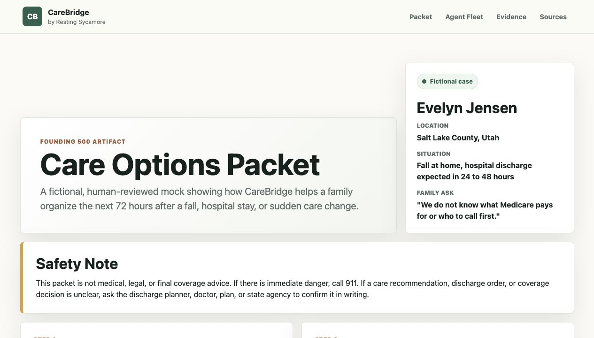

# CareBridge Founding 500 Evidence Package

This is a static artifact for the Hyperagent Founding 500 application.

It includes:

- A fictional CareBridge Care Options Packet for a Salt Lake County family
- A simple agent fleet workflow diagram
- Sanitized evidence screens from prior agent-built work
- Source and safety notes for Medicare, caregiving, cost, and product-boundary claims

## Local Preview

Open `index.html` in a browser, or serve the folder with any static server.

## Privacy Notes

The packet is fictional. The evidence screens avoid private lead data, protected health information, API keys, client information, and confidential source material.

## Source Notes

- Medicare long-term care: https://www.medicare.gov/coverage/long-term-care
- AARP and NAC Caregiving in the US 2025: https://www.aarp.org/pri/topics/ltss/family-caregiving/caregiving-in-the-us-2025/
- CareScout 2025 Cost of Care: https://investor.genworth.com/news-events/press-releases/detail/1054/carescout-releases-2025-cost-of-care-survey-results
- Hyperagent terms: https://hyperagent.com/terms?standalone=1
